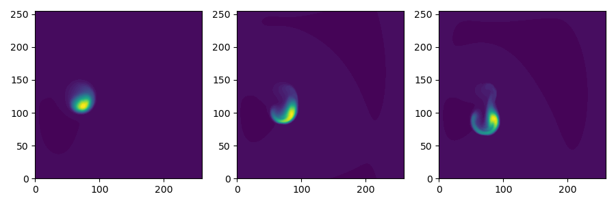

Blob2D, hot ion
===============

A seeded plasma filament in 2D. This version evolves both electron and
ion temperatures. A sheath-connected closure is used for the parallel
current.



The model components are
```
[hermes]
components = e, h+, vorticity, sheath_closure
```

The electron component evolves density (saved as `Ne`) and pressure
(`Pe`), and from these the temperature is calculated.

```
[e]
type = evolve_density, evolve_pressure
```

The ion component sets the ion density from the electron density, by
using the quasineutrality of the plasma; the ion pressure (`Ph+`) is evolved.

```
[h+]
type = quasineutral, evolve_pressure
```
