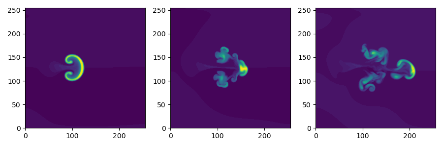

Blob2D
======

A seeded plasma filament in 2D. This version is isothermal and cold ion,
so only the electron density and vorticity are evolved. A sheath-connected
closure is used for the parallel current.



The model components are
```
[hermes]
components = e, vorticity, sheath_closure
```

The electron component consists of two types:
```
[e]  # Electrons
type = evolve_ne, isothermal
```

The `evolve_ne` component type evolves the electron density `Ne`. This component
has several options, which are set in the same section e.g.
```
poloidal_flows = false  # Y flows due to ExB
```

The `isothermal` component type sets the temperature to be a constant, and using
the density then sets the pressure. The constant temperature is also
set in this `[e]` section:
```
temperature = 5  # Temperature in eV
```

The `vorticity` component uses the pressure to calculate the diamagnetic current,
so must come after the `e` component. This component then calculates the potential.
Options to control the vorticity component are set in the `[vorticity]` section.

The `sheath_closure` component uses the potential, so must come after `vorticity`.
Options are also set as
```
[sheath_closure]
connection_length = 10 # meters
```

Analysis
--------

To plot the blob velocity over time, run the blob_velocity python script, giving
the directory containing the BOUT.dmp.* output data files as the argument:
```
$ python3 blob_velocity.py .
```
which should produce a plot and output pickle files.

Blob size scan
--------------

The `blob_size_scan.py` script generates inputs for a range of blob sizes,
runs the simulations, and analyses the output to produce a plot of blob
velocity against blob size. There are a number of options; run
```
$ python3 blob_size_scan.py --help
```
to see a list of the options.
