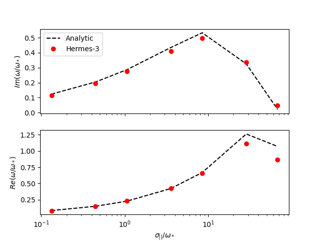

# Resistive drift-wave with finite electron mass



## Equations

The ion density is evolved, with zero velocity and fixed temperature:
```
[i]
type = evolve_density, fixed_velocity, fixed_temperature

charge = 1
AA = 1

velocity = 0
temperature = 100  # eV
```
So only the ExB drift advection of density is included.

The electron density is set to the ion density by quasi-neutrality,
and the parallel momentum is evolved:
```
[e]
type = quasineutral, evolve_momentum, fixed_temperature

charge = -1
AA = 1./1836

temperature = 100 # eV
```
Finally, the potential is evolved by a vorticity equation.

## Slab domain

The domain is a thin slab, with one cell in the X (radial) direction,
and periodic in both Y (parallel) and Z (binormal) directions.

The number of cells in each dimension are specified by `nx`, `ny` and
`nz`. Note that `nx` includes 2 boundary cells on either side, so `nx
= 5` is one cell in the middle, and 4 boundary cells.

The size of the domain in each dimension in meters is set by `Lx`, `Ly` and `Lz`.
These are not directly used by Hermes-3 or BOUT++, but are used to calculate the
metric tensor components and cell sizes.

The Y and Z cell sizes are `dy = Ly / ny` and `dz = Lz / nz`.
The X cell size is more complicated because the field-aligned
operators assume a Clebsch coordinate system, in which B = nabla z
cross nabla x.  See the [coordinates manual page](https://bout-dev.readthedocs.io/en/stable/user_docs/coordinates.html#magnetic-field)
for details. The `dx` cell size therefore includes a factor of the
magnetic field strength `B`. With this choice the metric tensor is
diagonal, with elements
```
g11 = B^2
g22 = 1
g33 = 1
```
and the Jacobian is `J = 1 / B`

## Boundary conditions

The radial boundary conditions on potential are Neumann for the
non-constant (AC) components, and zero for the constant (DC) component:
```
[vorticity:laplacian]
inner_boundary_flags = 2
outer_boundary_flags = 2
```

The density gradient is set by a boundary condition on `Ni`:
```
bndry_xin = neumann(mesh:inv_Ln * units:meters^2 * units:Tesla / mesh:B)
bndry_xout = neumann(mesh:inv_Ln * units:meters^2 * units:Tesla / mesh:B)
```
The inverse density length scale `inv_Ln` is set in the `mesh` section:
```
[mesh]
...
inv_Ln = 10 # Inverse density length scale [1/m]
```
The normalisation factors `units:meters^2 * units:Tesla / mesh:B` are because
the radial gradient is specified in terms of the normalised radial coordinate,
which is a magnetic flux in this Clebsch coordinate system.
